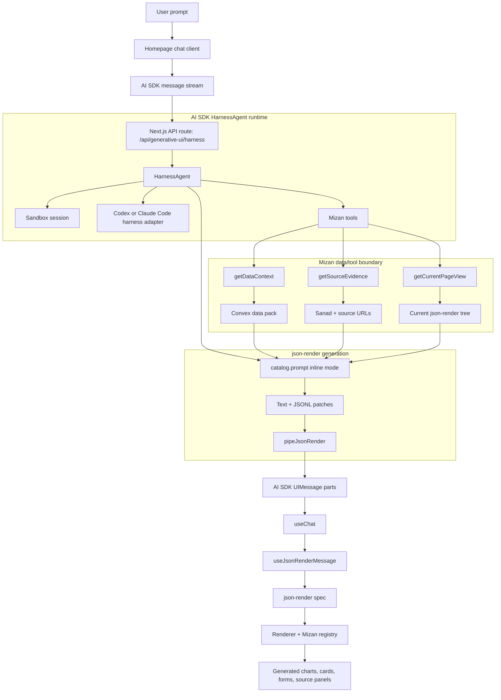
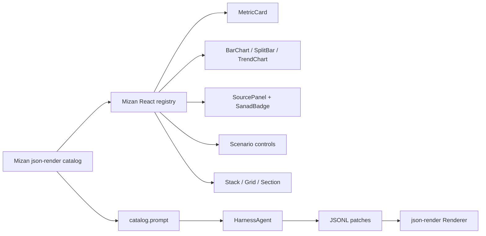

# Mizan Harness + json-render Generative UI

This documents the Mizan generative UI migration toward AI SDK HarnessAgent
plus json-render.

Current implementation:

- The homepage render boundary uses `@json-render/react`: generated board state is converted into a flat json-render spec and rendered through the Mizan registry.
- LLM calls use Vercel AI SDK directly. Convex remains the data authority and no longer hosts an external agent component.
- `/api/generative-ui/harness` is an opt-in HarnessAgent route. It is disabled unless `MIZAN_HARNESS_ENABLED=1` is set because it creates a Vercel Sandbox session.

Remaining migration:

- Change the homepage planner schema from `mzn-grid-v1` to direct json-render spec output.
- Stream json-render patches through AI SDK UI messages for progressive rendering.

## Target Flow

## Component Boundary

## Migration Rules

- Remove the LLM-specific `mzn-grid-v1` plan as the public UI contract.
- Keep Convex as the data authority. Harness tools receive bounded data packs, not raw table access.
- Let json-render own the UI tree shape through a catalog and registry.
- Keep Sanad/source links as first-class registry components.
- Keep follow-up continuity by passing the current json-render spec/tree into the harness route.
- Keep the public route deterministic at the component boundary: the harness can choose catalog components, but cannot emit arbitrary JSX/CSS.

## Package Notes

- `HarnessAgent` is in AI SDK 7 canary/beta harness packages.
- json-render `0.19.x` uses `@json-render/core` and `@json-render/react`.
- The app is on AI SDK 7 canary at the top level. Guide chat and the LLM data pipeline use Vercel AI SDK directly; Convex stores messages and data in first-party tables.
