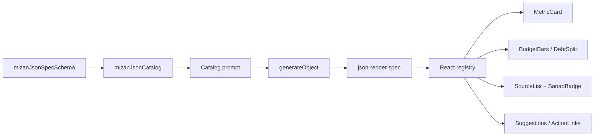

# Mizan Custom Harness + json-render

Mizan's generative home chat uses a project-owned harness boundary built from
the `ai` npm package and `@json-render/*`. It does not use Vercel-hosted
services, Vercel Sandbox, or AI SDK `HarnessAgent` in the product path.

## Current Flow

```mermaid
flowchart TD
  U[User prompt] --> C[Homepage chat]
  C --> R[Next route: /api/generative-ui/harness]
  C --> S[Current json-render spec]
  C --> D[Convex data context]

  subgraph MizanHarness[Mizan-owned harness]
    R --> SDK[Vercel AI SDK package: generateObject]
    SDK --> LLM[DeepSeek or OpenAI provider]
    LLM --> SPEC[Strict json-render spec]
  end

  SPEC --> V[Zod validation + normalization]
  V --> JR[@json-render/react Renderer]
  JR --> UI[Deterministic Mizan React components]
  UI --> Sources[Sanad badges + source links]
```

## Runtime Rules

- The endpoint name says `harness`, but it is Mizan's own harness, not
  `@ai-sdk/harness`.
- The only AI runtime dependency is the `ai` package plus provider adapters such
  as `@ai-sdk/openai`.
- The UI contract is a flat json-render spec validated by
  `mizanJsonSpecSchema`.
- The model chooses catalog components and copy. React owns values, source
  badges, chart rendering, links, styling, and interactions.
- Follow-up turns send the current spec and recent chat to preserve context.
- The route prefers `DEEPSEEK_API_KEY`; it falls back to `OPENAI_API_KEY`.

## Component Boundary



## Migration Notes

- `mzn-grid-v1` is no longer the home chat contract.
- `app/convex/uiAgent.ts` has been removed from the product chat path.
- No arbitrary JSX, CSS, SQL, external URLs, or sandboxed code execution should
  be accepted from the model.
- Data-backed values must come from Convex-derived context or first-party
  renderer lookups, not model-invented numbers.
